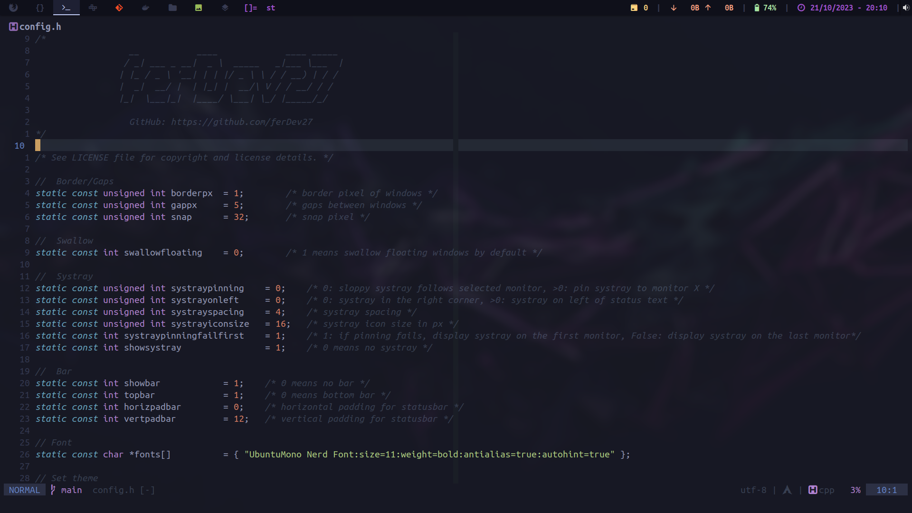

# ferDev27's custom build of DWM




Suckless **[dwm](https://dwm.suckless.org/)**

**Patches included:**

- *alwayscenter*
- *attachbottom*
- *autostart(.local/share/dwm/autostart.sh)*
- *centeredmaster*
- *clientmonoclesymbol*
- *coloredtag*
- *cyclelayouts*
- *gridmode*
- *movestack*
- *notitle*
- *pertag*
- *preserveonrestart*
- *restartsig*
- *status2d*
- *status2d-swap-save-res*
- *statusallmons*
- *swallow*
- *uselessgap*
- *warp*
- *statuspadding-afterstatus2d*


**Dependencies, if you use different software feel free to tweak the config.h file.**
**Assuming a base install of Arch linux:**
- First we will need some basic things:

```bash
sudo pacman -S base-devel xorg-server xorg-xinit libx11 libxinerama libxft webkit2gtk
```

**Terminal:**
- [st](https://st.suckless.org/)
- I have my [own](https://github.com/ferDev27/st) build as well 

**Menu:**
- [dmenu](https://tools.suckless.org/dmenu/) 

**File Manager:**
- ranger

```bash
sudo pacman -S ranger
```
 
**Screen and Audio:**
- brightnessctl
- pamixer

```bash
sudo pacman -S brightnessctl pamixer
```
 
**Screenshots:**
- scrot

```bash
sudo pacman -S scrot
```

**Healthy Eyes**
```bash
sudo pacman -S redshift 
```

**Font:**
- Ubuntu Mono Nerd Font

```bash
yay -S nerd-fonts-ubuntu 
```

**Status bar:**
- [dwmblocks](https://github.com/torrinfail/dwmblocks)


***Additional software that I use alongside the WM:***

**Compositor:**
- picom

```bash
sudo pacman -S picom
```

**Media:**
- feh

```bash
sudo pacman -S feh
```
- ffmpeg

```bash
sudo pacman -S ffmpeg
```
- sxiv

```bash
sudo pacman -S sxiv
```
- mpv

```bash
sudo pacman -S mpv
```

**PDF Reader:**
- zathura

```bash
sudo pacman -S zathura zathura-ps zathura-pdf-poppler 
```

**Clipboard:**
```bash
sudo pacman -S xclip 
```

**Other:**
- [wmname](https://tools.suckless.org/x/wmname/)

```bash
sudo pacman -S wmname pacman-contrib
```
 
